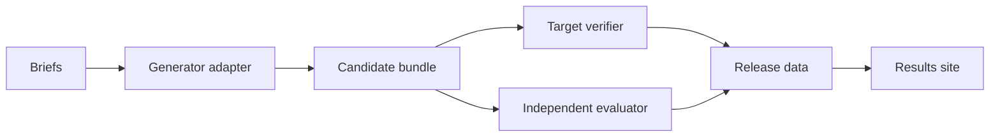

# exgen-bench

`exgen-bench` evaluates systems that generate complete programming exercises from instructor
briefs. It records the statement, starter code, reference solution, tests, resource use, and
independent evaluation results.

The experiment kernel is independent of any generation approach. Artemis Java/Maven/Ares is the
first target, and Hyperion is the first planned system under test.

> **Status:** pre-alpha. The deterministic local smoke pipeline works end to end. The proposed
> Artemis benchmark API, study dataset, and independent evaluator suite are not complete. No
> benchmark results have been published.

## Quick start

Install the [Bun](https://bun.sh/docs/installation) version listed in
[`.bun-version`](.bun-version), then run the local smoke benchmark:

```bash
bun install --frozen-lockfile
bun run smoke
```

The smoke run uses a deterministic local adapter and no credentials. It checks generation,
development evaluation, release verification, and a local site build, then removes its temporary
outputs.

To inspect the CLI:

```bash
bun run cli --help
```

## How it works



- Generator adapters implement the system being measured.
- Target verifiers validate platform-specific requirements.
- Evaluators read candidate bundles without changing them.
- The kernel schedules paired repetitions and records every outcome.
- Releases contain normalized data and provenance; the site only presents those releases.

Adapters run out of process through a versioned JSON file protocol:

```text
<command...> describe --json
<command...> generate --request REQUEST.json --output OUTPUT_DIRECTORY
<command...> recover --request REQUEST.json --output OUTPUT_DIRECTORY
```

Adapters that advertise crash recovery use `recover` to stop durable remote work before the runner
marks an uncertain attempt interrupted. The protocol schemas are published in
[`schemas/protocol/`](schemas/protocol/). The smallest working implementation is
[`examples/mock-generator.ts`](examples/mock-generator.ts).

## Run a benchmark

Start from [`examples/smoke/benchmark.yaml`](examples/smoke/benchmark.yaml):

```bash
bun run cli validate examples/smoke/benchmark.yaml
bun run cli plan examples/smoke/benchmark.yaml
bun run cli run examples/smoke/benchmark.yaml --id quickstart
bun run cli status .exgen/runs/quickstart
bun run cli evaluate bundle .exgen/runs/quickstart
```

If a run stops before every attempt starts, resume it with:

```bash
bun run cli resume .exgen/runs/quickstart --benchmark examples/smoke/benchmark.yaml
```

`resume` does not repeat terminal model calls.

Each configured system is one evaluated approach–model combination. Use the `approach`, `model`,
and `provider` factors to make those dimensions explicit in public comparisons; additional factors
remain available for study-specific variables.

Run state is stored under `.exgen/runs/`; use `bun run cli release --help` and the
[site guide](site/) to export and inspect a release.

Included integrations are an [OpenAI-compatible single-call baseline](adapters/openai-compatible/),
a client for the [proposed Artemis benchmark API](adapters/artemis/), and a static
[results explorer](site/). Release export is deterministic and atomic.

## Measurement rules

- Planned attempts define the primary denominator.
- Failed, abstained, cancelled, and missing outcomes remain distinct.
- Generator and evaluator identities are versioned separately.
- The same independent evaluator is used for every compared approach.
- Resource-budget violations cannot count as primary successes.
- Confirmatory analyses and contrasts are fixed in the benchmark configuration.

See [Methodology](docs/METHODOLOGY.md) for the measurement design and
[System design](SYSTEM-DESIGN.md) for implementation boundaries. The Artemis changes needed for a
formal campaign are described in [Artemis integration](docs/ARTEMIS-INTEGRATION.md).

Generated code is untrusted. The local command backend is for trusted development adapters only;
formal evaluation requires an isolated Linux environment. See [SECURITY.md](SECURITY.md).

See [CONTRIBUTING.md](CONTRIBUTING.md) to develop the project. Citation metadata is in
[`CITATION.cff`](CITATION.cff). Source code and documentation are licensed under the
[MIT License](LICENSE).

The TUM Applied Education Technologies group maintains this project; use
[GitHub Issues](https://github.com/ls1intum/exgen-bench/issues) for ordinary bugs and questions.
