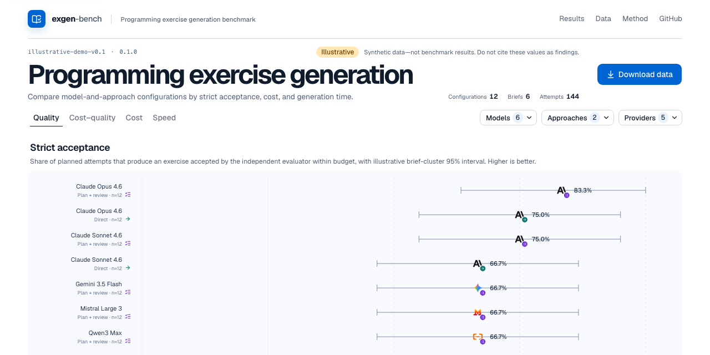
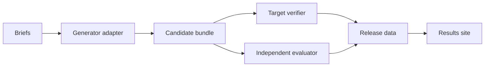

<div align="center">
  
  <h1>exgen-bench</h1>
  <p><strong>Open-source infrastructure for reproducible evaluation of systems that generate autograder-ready programming exercises from instructor briefs.</strong></p>
  <p>
    <a href="https://ls1intum.github.io/exgen-bench/">Explore the dashboard</a> ·
    <a href="./docs/METHODOLOGY.md">Methodology</a> ·
    <a href="./CONTRIBUTING.md">Contributing</a>
  </p>
</div>

[](https://ls1intum.github.io/exgen-bench/)

_Illustrative dashboard using synthetic data. It does not show empirical benchmark results._

> **Project status:** pre-alpha. The local smoke pipeline and public result format work end to
> end. The smoke evaluator verifies bundle integrity, not correctness or educational quality. The
> study dataset, validated evaluator suite, and Artemis benchmark API are not complete. No
> empirical benchmark results have been released.

## Why exgen-bench

A usable programming exercise is more than a model response. It includes a problem statement,
starter code, a reference solution, tests, and target-platform constraints. Comparing generation
systems therefore requires controlling briefs, budgets, target verification, and independent
evaluation while retaining failed and missing attempts.

exgen-bench provides a resumable experiment runner, a language-neutral adapter protocol, a
versioned result contract, and a static evidence explorer. It is intended for computing-education
researchers, generation-system developers, and teaching-platform maintainers.

## What works today

- Resumable, paired experiment execution with explicit outcome accounting
- Out-of-process generator adapters with versioned JSON Schemas
- Separately versioned evaluation journals and deterministic release export
- A versioned public data contract, checksummed releases, and a static results dashboard
- Deterministic development fixtures for CI and local testing

## Try it locally

Install the [Bun](https://bun.sh/docs/installation) version listed in
[`.bun-version`](.bun-version), then run:

```bash
bun install --frozen-lockfile
bun run smoke
```

The smoke pipeline needs no credentials. It exercises planning, generation, resume-safe storage,
development evaluation, release verification, and the static site with a deterministic mock
generator. It is a system check, not a scientific evaluation.

To explore the checked-in illustrative dashboard:

```bash
bun run site:serve
```

Open <http://localhost:4173>. Run `bun run cli --help` to see the available commands.

## How it works



The kernel schedules paired repetitions and records every outcome. Generator adapters implement
the system under test, target verifiers check platform constraints, and separately versioned
evaluators read candidate bundles without changing them. The results site only presents
precomputed, checksummed release data.

| Integration | Status | Purpose |
| --- | --- | --- |
| [Mock generator](examples/mock-generator.ts) | Included | Deterministic development and CI |
| [OpenAI-compatible adapter](adapters/openai-compatible/) | Included | Single-call baseline |
| [Artemis adapter](adapters/artemis/) | Client implemented against a proposed API | Whole-exercise generation and canonical verification |

The adapter protocol and schemas are published in [`schemas/protocol/`](schemas/protocol/). The
[system design](SYSTEM-DESIGN.md) explains component boundaries, persistence, and lifecycle
invariants.

## Measurement principles

- Planned attempts define the primary denominator.
- Failed, abstained, cancelled, and missing outcomes remain distinct.
- Generator and evaluator identities are versioned separately.
- Every compared approach uses the same independent evaluator.
- Resource-budget violations cannot count as primary successes.
- Confirmatory analyses and contrasts are fixed in the benchmark configuration.

See the [methodology](docs/METHODOLOGY.md) for the estimand, experimental design, missing-data
handling, and reporting rules. The [Artemis integration](docs/ARTEMIS-INTEGRATION.md) specifies
the platform changes required for a formal campaign.

Generated code is untrusted. Formal evaluation requires an isolated Linux environment; see the
[security policy](SECURITY.md). Contributions are described in
[CONTRIBUTING.md](CONTRIBUTING.md), and citation metadata is available in
[`CITATION.cff`](CITATION.cff).

The TUM Applied Education Technologies group maintains exgen-bench. Source code and documentation
are available under the [MIT License](LICENSE).
