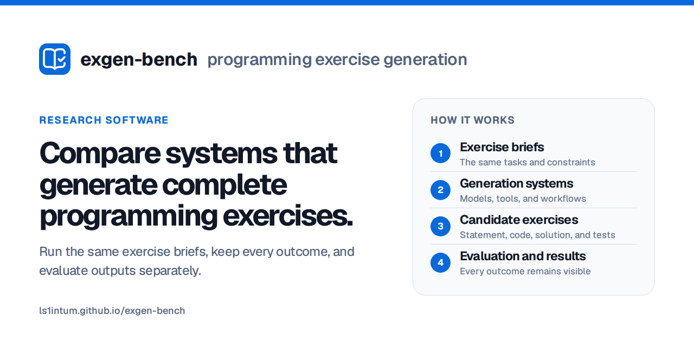

# exgen-bench

exgen-bench runs the same programming-exercise generation tasks across different systems, records
every outcome, and prepares the generated exercises for separate evaluation.

<p align="center">
  
</p>

<p align="center">
  <a href="https://ls1intum.github.io/exgen-bench/">Illustrative results site</a> ·
  <a href="./docs/README.md">Documentation</a> ·
  <a href="./CONTRIBUTING.md">Contributing</a>
</p>

> **Status:** pre-alpha. The local smoke test and public result format work. The included smoke
> evaluator checks file completeness, not whether an exercise is correct or suitable for teaching.
> The study dataset, validated evaluator, and Artemis benchmark API are not finished. No empirical
> benchmark results have been released.

## What problem does it solve?

A programming exercise usually needs a problem statement, starter code, a reference solution,
tests, and platform settings. Comparing generation systems therefore requires more than comparing
model responses. Each system must receive the same tasks and budgets, and failures must remain in
the results.

exgen-bench provides a shared runner and file format for these comparisons. It is intended for
computing education researchers, developers of generation systems, and teaching-platform
maintainers.

## What is included?

- A runner that schedules the same cases across systems and can continue an interrupted run.
- A process-based interface for connecting generation systems written in any language.
- Separate evaluation, so generated exercises can be checked again without rerunning generation.
- Release files with checksums for analysis and the static results site.

## Try it locally

Install the [Bun](https://bun.sh/docs/installation) version listed in
[`.bun-version`](.bun-version), then run the smoke test:

```bash
git clone https://github.com/ls1intum/exgen-bench.git
cd exgen-bench
bun install --frozen-lockfile
bun run smoke
```

The smoke test uses a fixed mock generator and does not need credentials. It checks the local
workflow but does not measure exercise quality.

## Run the small example

The checked-in example contains one exercise brief and one mock generation system:

```bash
bun run cli validate examples/smoke/benchmark.yaml
bun run cli plan examples/smoke/benchmark.yaml
bun run cli run examples/smoke/benchmark.yaml --id quickstart
bun run cli status .exgen/runs/quickstart
bun run cli evaluate bundle .exgen/runs/quickstart
```

Use a new run ID if you repeat the example. The `bundle` evaluator checks that the expected files
exist; it is not a scientific evaluator. Run `bun run cli --help` for the complete command list.

## How a benchmark runs

1. A dataset supplies versioned **exercise briefs**: the task descriptions visible to every
   generation system.
2. Each **generation system** receives the same cases, repetitions, and resource limits.
3. Successful runs produce **candidate exercises** containing the statement, starter code,
   reference solution, tests, and platform metadata.
4. A separately versioned **evaluator** checks each candidate. The release keeps successes,
   failures, missing results, and resource use.

See the [glossary](docs/GLOSSARY.md) for the terms used in the configuration, result files, and
documentation.

## Documentation

| If you want to… | Read… |
| --- | --- |
| understand the components and saved data | [System design](SYSTEM-DESIGN.md) |
| understand the study design and outcome rules | [Methodology](docs/METHODOLOGY.md) |
| connect Artemis or Hyperion | [Artemis integration](docs/ARTEMIS-INTEGRATION.md) |
| connect another generation system | [Protocol schemas](schemas/README.md) |
| build or preview the results site | [Results-site guide](site/README.md) |
| find the meaning of a term | [Glossary](docs/GLOSSARY.md) |

## Rules for comparisons

- The planned attempts, including attempts that never start, define the main denominator.
- Failures, abstentions, cancellations, and missing results stay separate.
- Every system in a formal comparison uses the same independent evaluator.
- An attempt cannot count as a success if it exceeds its stated resource limits.
- The study configuration fixes the main analysis before the run.

Generated code is untrusted. Formal evaluation requires isolated Linux execution; see the
[security policy](SECURITY.md). Use
[GitHub Issues](https://github.com/ls1intum/exgen-bench/issues) for bugs and methodology proposals,
and report vulnerabilities privately.

The TUM Applied Education Technologies group maintains exgen-bench. Citation metadata is in
[`CITATION.cff`](CITATION.cff). Code and documentation are available under the
[MIT License](LICENSE).
