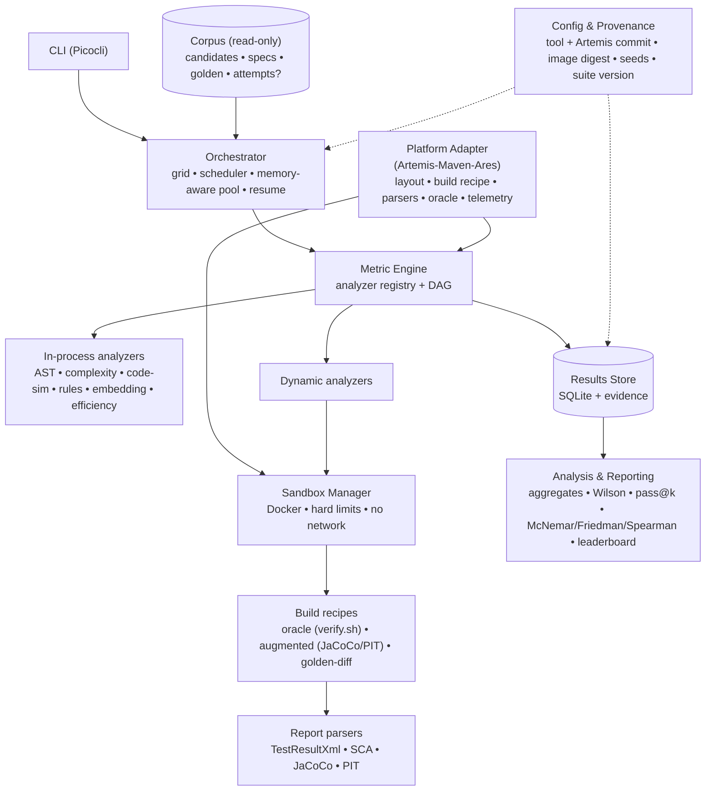
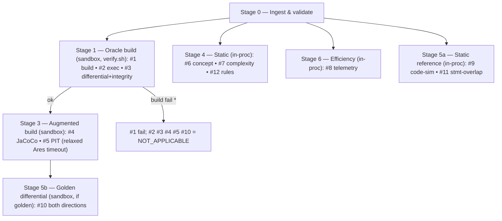

# Exercise-Quality Assessment Framework — System Design

**Project:** A reusable framework for automatically assessing the quality of generated, auto-grader-ready programming exercises — **instantiated for Artemis** (Java/Maven/Ares) as the first platform adapter.
**Companion paper:** *From Prompt to Autograded Exercise: Verified LLM Generation for Programming Education* (see `evaluation-design-v2.pdf`)
**Generator (external):** Artemis "Hyperion" — [ls1intum/Artemis#13156](https://github.com/ls1intum/Artemis/pull/13156) (pin the merged commit)
**Status:** Design proposal, v3. Implementation deferred.
**Date:** 2026-07-22

---

## 1. Purpose, framing & scope

This system computes, **automatically and deterministically**, the Tier-1 quality metrics (no LLM, no human, no consistency checker) for generated Artemis programming exercises, and turns them into the reusable **model × variant × metric leaderboard** and Tier-1 statistics.

**Three framing facts settled with the team:**

1. **It is a general framework, Artemis is the example.** The tool assesses "generated auto-grader-ready exercises"; Artemis/Maven/Ares specifics live behind a **platform-adapter seam** (§4), so the metrics and orchestration generalise and Artemis is simply the one implemented adapter.
2. **Evaluation only, on the M5.** Generation runs entirely inside Hyperion, elsewhere. The tool's input is an **exported corpus** of exercises; it never generates.
3. **Saved artifacts + a per-cell attempt log.** Hyperion exports the *artifacts* only for candidates it persisted (outcome **Success** or **Needs review**); mechanically-failed attempts have no artifacts. But a lightweight **per-cell attempt-outcome log** — counts + telemetry for all *k* attempts — *is* exported alongside them (§3.5, confirmed). So **quality** is profiled on the saved corpus (#4–#12) while **yield** (H1/H2a/pass@k) is computed from the attempt log. This reshapes what each metric *means* (§1.2).

### 1.1 In-scope metrics

| # | Metric | Signal | Tooling (Artemis adapter) | Exec |
|---|--------|--------|-----------|------|
| 1 | Buildability | template & solution compile | LocalCI sandbox build (`verify.sh`) | sandbox |
| 2 | Executability | tests run, JUnit report produced | Ares/JUnit 5 + surefire; `TestResultXmlParser` | sandbox |
| 3 | Oracle correctness | solution passes all; template fails all **non-structural gradable** tests (structural may pass); + integrity gates | `DifferentialVerificationService` (reused/replicated) | sandbox |
| 4 | Test coverage | statement & branch | **JaCoCo Maven plugin** (augmented build) | sandbox |
| 5 | Test strength | mutation score (killed/generated) | **PIT Maven plugin** (augmented build) | sandbox |
| 6 | Concept fidelity | required constructs present | JavaParser AST + LocalCI SCA (Checkstyle/PMD/SpotBugs) | in-proc |
| 7 | Complexity fit | cyclomatic/cognitive complexity in range | PMD/Checkstyle metrics | in-proc |
| 8 | Efficiency | tokens, cost, latency, repair iterations | Hyperion telemetry (`AgentLoopResult`, budget service) | in-proc |
| 9 | Code similarity | CodeBLEU, AST edit distance | JavaParser + APTED | in-proc |
| 10 | Behavioural match | golden tests ↔ generated solution (both ways) | differential testing (reuse build machinery) | sandbox |
| 11 | Statement overlap ⚠️ | embedding similarity (**weak, optional**) | local embedding model (DJL/ONNX) | in-proc |
| 12 | Item-writing flaws (rule-based only) | rule pack over statement + tests | rule engine + SCA signals | in-proc |

### 1.2 Metric *roles* on a saved-only corpus (important)

Because only accepted exercises are exported, the metrics split by role:

- **Verification / parity gates — #1, #2, #3.** Accepted exercises already passed Hyperion's oracle, so these should be ≈100 %. Their value here is (a) **independent confirmation** that each exported exercise is genuinely well-formed, (b) a **parity check** that our rebuild agrees with Hyperion's verdict (disagreement ⇒ export corruption, environment drift, or a gate bug), and (c) evidence for RQ3 ("how much can be assessed automatically"). They are **not** the comparative signal.
- **Comparative quality metrics — #4, #5, #6, #7, #9, #10, #11, #12.** These *vary among accepted exercises* and are the real basis for comparing models and variants (H2b) and for golden-deviation (H4).
- **Cost — #8.** Per-accepted-exercise generation cost.

### 1.3 Out of scope

Generation (Hyperion) · **Consistency**/quality review (`SpecFidelityCriticService`/`GenerationReviewService`, the [2] checker, LLM) · Tier-2 judge dimensions and the LLM-judge part of item-writing flaws · Tier-3 expert rating · judge-agreement statistics.

### 1.4 Caveats carried

#11 needs an embedding model → optional/pluggable/disableable (CodeBLEU stays core) · #6/#7 need a per-input **eval spec** (§3.3) · #3 uses the structural-vs-behavioural distinction, not "template 0 %".

### Design goals
Deterministic & reproducible (pinned tools, image digests, pinned Artemis commit) · correct under failure (§9) · resumable & cached · sandboxed & network-off · extensible, versioned suite · single-node (M5) · **platform-general behind the adapter seam**.

---

## 2. Confirmed decisions

| Decision | Choice |
|----------|--------|
| Stack | **Java / JVM end-to-end** |
| Build system (Artemis adapter) | **Java + Maven** (`MAVEN_MAVEN`/`PLAIN_MAVEN`) + Ares/JUnit 5 |
| Artemis coupling | **Standalone runner**; reuse Artemis build/parse code where the dependency footprint allows, else replicate/vendor — decided by a spike (§13.4) |
| Assessment target | **Exported corpus of *saved* exercises** (Success / Needs review); no not-saved artifacts |
| Generality | **Platform-adapter seam**; Artemis-Maven-Ares is the one adapter |
| Environment | **Single Apple Silicon node (M5, 48–64 GB)**, evaluation only |

---

## 2b. How exercises are produced — Artemis Hyperion (context)

Hyperion runs an **agent loop** (`AgentLoopRunner`, ≤ `max-turns` 40) with an optional **spec-fidelity critic** (`SpecFidelityCriticService`), an in-loop self-check and a post-loop **`DifferentialVerificationService`**, then **guarded persistence** into the exercise git repos. One job = one network-isolated sandbox (2 CPU/2 GiB).

**Layout (Maven/Ares):** `solution/src/<pkg>`, `template/src/<pkg>` (same signatures, placeholder bodies), `tests/test/<pkg>` (test dir is `test`), `tests/pom.xml`. JUnit 5 + Ares (`artemis-java-test-sandbox`): classes carry `@Public @WhitelistPath("target") @BlacklistPath("target/test-classes")`, `@Test`s carry `@StrictTimeout(1)`; `[task]` binds by test **method name**; structural tests may be **seeded** (early "starter credit").

**Oracle (= #1–#3):** `verify.sh <solution|template>` reproduces the CI layout and Maven phases; parses with the grader's own `TestResultXmlParser` + SCA `ReportParser`. Solution passes **all**; template fails **every non-structural gradable** test (seeded structural may pass); plus integrity gates (harness immutability, no solution leak, Ares conventions, source-layout/package match, extraction soundness, adapt-wipe).

**Telemetry (= #8):** `AgentLoopResult{status, turns}` + `HyperionGenerationBudgetService` (tokens) + duration + `GenerationOutcome`.

**Variant mapping (paper factors):** full-agentic = default · loop-without-critic = disable `SpecFidelityCriticService` · single-pass = no verify/repair loop. **These variants do not exist yet — the team will implement them in Hyperion for the study (§13.3).** For this tool a variant is just a label on the record.

---

## 3. Inputs & contracts

> **Formalised as JSON Schema** in [`schemas/`](schemas/) (`candidate-record`, `attempt-log`, `input-spec`, `common`) — validated, with worked examples and negative controls. See [`schemas/README.md`](schemas/README.md) for the producer of each file and the validation commands. §3.3–3.5 below are the human-readable summary.

### 3.1 Candidate
The four artifacts of one accepted `(input, model, variant, run)` cell.

### 3.2 Build model — reuse or replicate the LocalCI build
Run `verify.sh` in a sandbox for the oracle build; parse with `TestResultXmlParser` / SCA `ReportParser`; optionally call `DifferentialVerificationService` directly for #1–#3 + integrity. Whether this is **library reuse** or **vendored/replicated** is settled by the spike (§13.4); either way pin the Artemis commit and **validate parity against a known exercise (BubbleSort)**. The harness's own builds (coverage/mutation, golden-diff) are **separate augmented Maven recipes** on the same sandbox (§6–§7).

### 3.3 Per-input evaluation spec (required)
```jsonc
{ "input_id":"itp-2024-recursion-01",
  "required_constructs":[{"kind":"recursion","in":"solution"},{"kind":"no_loop","in":"solution"}], // #6
  "complexity_band":{"cyclomatic":{"min":2,"max":8},"cognitive":{"max":12}},                        // #7
  "item_writing_rules":["no_answer_in_graded_test","statement_test_agreement"],                      // #12
  "golden_ref":"golden/itp-2024-recursion-01/", "concept":"recursion" }                              // #9/#10/#11
```

### 3.4 Per-candidate record (required)
```jsonc
{ "candidate_id":"…","input_id":"…","model":"gpt-oss-120b",
  "variant":"full-agentic|loop-no-critic|single-pass","run":3,
  "artifacts":{"problem_statement":"…","template/":"…","solution/":"…","tests/":"…"},
  "hyperion_outcome":"SUCCESS|NEEDS_REVIEW",          // saved-only corpus ⇒ these two values
  "hyperion_verdict":{"mechanically_verified":true,"solution_passed":true,"template_failed":true,
                      "test_count":5,"reasons":[…]},  // cross-check vs our #1–#3
  "structural_test_names":["…"],                       // apply the correct oracle (#3)
  "efficiency":{"prompt_tokens":0,"completion_tokens":0,"total_tokens":0,"turns":0,
                "agent_status":"COMPLETED","duration_s":0.0,"repair_iterations":0,"cost_usd":0.0} } // #8
```

### 3.5 Per-cell attempt log (required, confirmed)
Not-saved *artifacts* are not exported, but a per-cell record of all *k* attempts **is** (each generation job already has a `GenerationOutcome` + telemetry):
```jsonc
{ "input_id":"…","model":"…","variant":"…",
  "attempts": [ {"run":1,"outcome":"NOT_SAVED","turns":40,"total_tokens":…,"duration_s":…},
                {"run":2,"outcome":"SUCCESS","…":…} ] }
```
This makes **save-rate / any-of-k / pass@k / H1 / H2a** computable from counts, using Hyperion's verdict as the deployability signal — no failed artifacts required. **Reconciliation:** every `SUCCESS`/`NEEDS_REVIEW` entry must match a candidate in `candidates/` (by `run` within the cell); a mismatch is a data-integrity error, surfaced not ignored.

### 3.6 Golden reference (optional, per input)
Vetted deployed exercise in the same Maven/Ares format → #9/#10/#11. Absent ⇒ `NOT_APPLICABLE`.

### 3.7 Corpus layout
```
corpus/
  inputs/<input_id>/{spec.json, golden/{solution,template,tests,problem-statement.md}}
  candidates/<candidate_id>/{record.json, problem-statement.md, template/, solution/, tests/}
  attempts/<input_id>__<model>__<variant>.json   # per-cell attempt log (§3.5)
```

---

## 4. Architecture



**Platform-adapter seam.** A `PlatformAdapter` encapsulates everything Artemis-specific: exercise layout, build-recipe generation, result/SCA parsing, oracle semantics (structural vs behavioural), and the telemetry schema. Metrics #4–#12 consume the adapter's *normalised* outputs (assembled workspace, parsed test results, ASTs), so they stay platform-general; only #1–#3 and the build recipes are adapter-bound. Today there is exactly one adapter (Artemis-Maven-Ares).

**Modules:** `:core` · `:adapter-artemis` · `:sandbox` · `:metrics` · `:store` · `:analysis` · `:cli`. Apple Silicon: all JVM tools are arm64-native; Docker via OrbStack/Colima/Docker Desktop; the Artemis LocalCI build image must be present.

---

## 5. Metric engine
```java
interface MetricAnalyzer { MetricId id(); Set<Capability> requires(); MetricResult analyze(EvalContext ctx); }
record MetricResult(MetricId id, Status status, Object value, Path evidence, Provenance provenance);
// Status: OK | NOT_APPLICABLE | BUILD_FAILURE | HARNESS_ERROR | TOOL_ERROR | TIMEOUT
```
Capabilities (`SANDBOX_BUILD`, `GOLDEN_REF`, `EVAL_SPEC`, `TELEMETRY`) drive a DAG; **one build per recipe** is shared across the metrics that need it.

---

## 6. Pipeline (per candidate)

\* On a saved corpus a build failure at Stage 1 is itself a finding (parity break) — logged loudly, not silently dropped.

**Oracle (#3, corrected).** `solution_builds ∧ solution_passes_all ∧ template_builds ∧ (every non-structural gradable test fails on template) ∧ integrity_gates`, exempting `structural_test_names`. Record our verdict **and** Hyperion's; assert agreement.

**Two builds.** Oracle build (Ares `@StrictTimeout(1)`) → #1–#3. **Coverage/mutation → a separate augmented Maven build** with the JaCoCo+PIT plugins and **relaxed Ares timeouts** (PIT forks JVMs; strict timeout + Ares SM would break it — §13.5).

---

## 7. Sandboxing & builds
Network-isolated, non-root, read-only source mounts, tmpfs workdir, CPU/mem/pids limits, wall-clock kill; offline Maven dependency cache baked into the pinned image (unlisted dependency ⇒ deterministic fail, recorded). Recipes: **oracle** (`verify.sh solution|template`), **augmented** (`jacoco:report` + `pitest:mutationCoverage`, PIT seed/threads pinned), **golden-diff** (golden-tests+gen-solution and gen-tests+golden-solution). Determinism: pin Artemis commit + JDK + Maven + plugin versions via image digest; fix PIT seed/threads; strip report timestamps.

---

## 8. Results store & provenance
Rows keyed by `(input_id, model, variant, run, metric_id)` → status, typed value, evidence path, duration, provenance (harness + **metric-suite version + pinned Artemis commit** + tool versions + image digest + seed). SQLite + raw reports on disk. **Content-hash cache** (`artifacts + suite_version + image_digest + config`) → cheap resume, free re-analysis.

---

## 9. Failure taxonomy
Never count infra flakiness as low quality. Quality signal (keep) · `NOT_APPLICABLE` (correct denominator) · `HARNESS_ERROR` (retry ≤N, else flag/exclude) · `TOOL_ERROR` (retry once) · `TIMEOUT` (bounded retry, report separately). On a saved corpus, a genuine `BUILD_FAILURE`/oracle-mismatch is escalated as a **parity anomaly**, not averaged away.

---

## 10. Analysis & reporting

**Primary results (fully computable on the saved corpus):**
- **Per-metric quality distributions** for #4–#12 across the corpus (Wilson CIs for rates; medians/IQR for coverage & mutation).
- **H2b (models):** rank models on the comparative metrics — **Friedman + Nemenyi + Holm**, **Cliff's δ / Vargha–Delaney** effect sizes.
- **H4 (golden deviation):** **Spearman ρ** between golden-deviation (#9/#10/#11) and the quality metrics.
- **Leaderboard:** `model × variant × metric` (CSV/JSON/Markdown).

**Yield results (from the §3.5 attempt log — confirmed in scope):**
- **Save-rate, any-of-k, pass@k** per cell.
- **H1 (feasibility):** the fraction of inputs with ≥1 saved exercise (any-of-k) — from the attempt log — *and* that accepted exercises meet the quality thresholds (construct presence, median mutation ≥ 0.8, median coverage ≥ 0.9) — from #4–#12 on the saved corpus. H1 combines both.
- **H2a (approach):** full-agentic vs single-pass as a **yield** comparison (McNemar/Fisher, paired on inputs; Cliff's δ effect size). Deployability = Hyperion's verdict; the tool re-verifies it (#1–#3) on the saved subset as a parity check.

**⚠ Survivorship note (now mitigated).** Quality metrics (#4–#12) are still measured only on *saved* exercises, so *quality-among-survivors* remains survivorship-limited — but the approach question (H2a) is now answered where it belongs, on **yield**, using the attempt log. Report both in the paper: the yield gap between approaches, and the among-survivors quality. Model comparison at a fixed variant (H2b) is the least exposed and remains the safest primary quality claim.

Outputs also include a **reproducibility bundle** (suite version, pinned Artemis commit, image digests, tool versions, seeds).

---

## 11. Concurrency & resources (single M5 node)
Worker pool ≈ `cores − 2`, memory-aware admission (Maven build ≈ 1–2 GB; measured dev machine 12 cores / **32 GB** → ~6 concurrent oracle builds; a 48–64 GB eval host → ~8–10). **PIT is the cost driver** → bounded lane (2–4) + knob **full/sampled/off**, `log()`-reported. Checkpoint/resume via the cache. Scale ≈ `|saved corpus| × metrics`; mutation dominates. Knobs: subset corpus, sample mutation, disable #11.

---

## 12. Extensibility & versioning
Add a metric → implement `MetricAnalyzer`, register, bump `metric_suite_version` (in the cache key). Add a model/variant → drop in records, re-run. **Add a platform** → implement a new `PlatformAdapter` (the framework's generalisation path). Fixed suite = pinned versioned config, released with the pinned Artemis commit.

---

## 13. Open decisions

**Resolved:** build = Maven · assessment target = saved corpus + per-cell attempt log (yield in scope) · generation is external, eval-only on M5 · variants are external Hyperion work · framework generalises via the adapter seam · **dependency footprint = vendor parsers, replicate sandbox+oracle (Phase-1 spike — see [`SPIKE-FINDINGS.md`](SPIKE-FINDINGS.md))**.

**Still open:**
1. **Artemis dependency footprint — RESOLVED (Phase-1 spike).** Vendor `TestResultXmlParser` + SCA `ReportParser` (Spring-free; 3-file closure compiled & tested standalone), replicate the sandbox with a thin Docker layer and replicate the oracle logic; pin the Artemis commit. Build substrate (JDK-17 Maven + Ares 1.15.0 on arm64) validated. See [`SPIKE-FINDINGS.md`](SPIKE-FINDINGS.md).
2. **Variant semantics.** Confirm the exact Hyperion toggles the team will add for single-pass and loop-without-critic, and that the `variant` label + attempt-log outcomes are carried per record.
3. **Attempt-log schema.** Finalise the exact §3.5 fields the generation experiment will emit (outcome enum, token/turn/duration fields) so ingestion + reconciliation are exact.
4. **PIT/JaCoCo under Ares (§6):** confirm the augmented build can relax `@StrictTimeout(1)`/Ares SM for PIT's forked JVMs; fallback = mutation on a de-Ares'd copy of solution+tests.
5. **Golden-truth corpus** in Maven/Ares format, paired to inputs.
6. **Concept-spec authoring** + construct vocabulary (#6); **complexity tool** PMD vs Checkstyle (#7).
7. **CodeBLEU** realisation (default APTED + keyword n-gram; full CodeBLEU optional) (#9).
8. **Embedding model** for #11, or drop it.
9. **k and mutation-sampling** policy.

---

## 14. Build-out phases
1. **Footprint spike + oracle parity** — ✅ footprint resolved & build substrate validated ([`SPIKE-FINDINGS.md`](SPIKE-FINDINGS.md), [`spike/`](spike/)); **remaining:** port the MAVEN_MAVEN assembly into `:adapter-artemis` + `:sandbox` and finish the BubbleSort oracle parity (#1–#3).
2. **Adequacy** — augmented recipe; #4 JaCoCo, #5 PIT (+ §13.4).
3. **Static + efficiency** — #6, #7, #12, #8.
4. **Reference-based** — #9, #10 (golden diff), #11 optional.
5. **Analysis & leaderboard** — quality distributions, H2b, H4, and the yield module (§3.5): save-rate, pass@k, H1, H2a.
6. **Provenance, caching, resume** polish.
```
