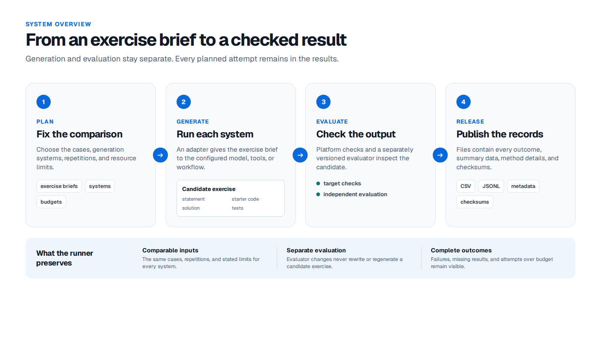

# System design

This document explains the components that run a benchmark and the records they save. The
[glossary](docs/GLOSSARY.md) defines the project terms used here.

## At a glance

The benchmark compares complete generation systems rather than models alone:

1. The plan fixes the cases, systems, repetitions, and resource limits.
2. A generator adapter runs each system and records its output or failure.
3. Target checks and a separately versioned evaluator inspect each candidate exercise.
4. The release contains every planned outcome, summary data, method details, and checksums.

## Interfaces

Generator adapters run as separate processes. JSON requests, JSON responses, and declared artifact
paths are the public interface; TypeScript types are internal. The Artemis evaluator also runs as a
separate process. Other evaluators, including the built-in file-completeness check, run inside the
benchmark process. They are development tools, not isolation for a formal study.

A benchmark configuration fixes:

- dataset version and digest;
- target version and revision;
- system versions, revisions, factors, runtime, and parameters;
- repetitions, paired seeds, budgets, and concurrency; and
- analysis method, contrasts, and registration metadata.

Before a run, each generator describes its name, version, and supported targets. This description
must match the configuration. The runner saves it in the run manifest and checks it again when a
run continues.

## Identity

The runner gives different records different IDs:

| Record | What its ID represents |
| --- | --- |
| Plan | The complete, resolved comparison design |
| Planned attempt | One case, generation system, and repetition |
| Generation key | The case, system, target, seed, and budget |
| Observation | What happened when one planned attempt ran |
| Evaluation | The candidate, evaluator, test suite, metrics, and time limit |

The runner hashes a stable JSON representation to create these IDs. Candidate hashes include each
file's role and a sorted file tree. Identical files do not merge two attempts, and changing an
evaluator does not rerun generation.

## Execution and resume

The runner writes the complete plan before generation starts. SQLite coordinates work and stores
events. A bounded queue can run attempts in parallel. Each attempt writes to a temporary directory;
the runner moves it into its final location only after the response, declared files, and evidence
manifest pass validation. Malformed or partial output may remain in the private evidence directory
for diagnosis.

The runner does not modify a finished attempt directory. If a remote generation might still be
running, the runner asks an adapter that supports recovery to cancel it. If cancellation cannot be
confirmed, the attempt remains running so `resume` can try again. After recovery from a runner
crash, the attempt is marked `interrupted` and is not sampled again automatically. `resume` starts
only attempts that are still planned.

Limits always cover elapsed time and may also cover model calls, tool calls, tokens, and cost. The
runner enforces elapsed time. Adapters report observed use, whether the requested random seed was
used, and whether provider request IDs were captured.

## Evaluation

Evaluation has its own resumable record. A candidate can be checked with a new evaluator or test
suite without changing or regenerating it.

The Artemis integration runs its coordination code in a child process with a time limit. On
timeout, the runner asks the process to stop, force-stops it if needed, and waits for it to exit
before saving the result. Artemis remains responsible for isolating and stopping the untrusted
build and test processes. Evaluators that run inside exgen-bench must stop cooperatively.

Generation outcomes and evaluation outcomes remain separate:

- executor or protocol failures have no candidate;
- a generator may fail or abstain while completing normally;
- an evaluator may reject a complete candidate on quality grounds; and
- evaluator infrastructure failures have no quality verdict.

A strict success requires a complete candidate exercise, evaluator acceptance, and evidence that
the attempt stayed within its resource limits.

## Releases

A release contains versioned JSONL and CSV data, analysis summaries, metric descriptions,
checksums, Croissant metadata, and an RO-Crate. Its manifest lists every published file and hash;
`exgen release verify` detects later changes.

The public export removes arbitrary runtime parameters, local paths, evaluator messages, and
evidence locations. Hashes can link public records to a separately retained private archive. The
static site reads a verified release and does not recalculate study results.

## Artemis

Artemis needs two reusable server-side functions:

1. whole-exercise generation that can export every terminal workspace without persisting a live
   exercise; and
2. candidate verification that returns structured results independently of generation.

The benchmark API and refactoring boundary are defined in
[docs/ARTEMIS-INTEGRATION.md](docs/ARTEMIS-INTEGRATION.md).

## Security

The command backend executes with the current user's permissions and is intended for trusted local
adapters. Formal runs require isolated execution and bounded resources. [SECURITY.md](SECURITY.md)
defines the trust boundaries and deployment baseline.
