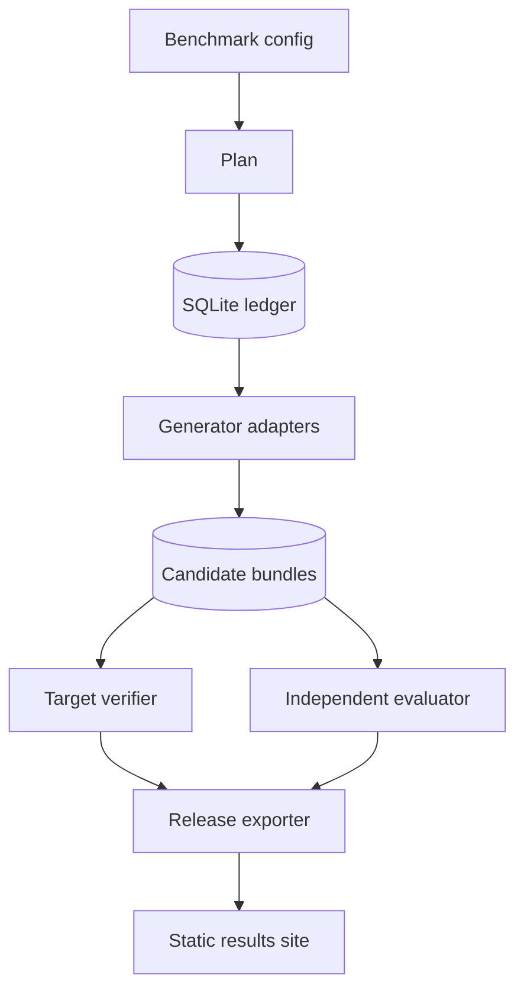

# System design

## Scope

The benchmark measures a complete generation system: a visible brief enters a generator, and an
immutable exercise bundle is evaluated independently. Generation approach, target platform, and
evaluation suite are separate contracts.

## Public boundaries

Adapters are separate processes. JSON requests, JSON responses, and declared artifact paths form
the interoperability boundary; TypeScript types are internal.

A benchmark configuration fixes:

- dataset version and digest;
- target adapter version and revision;
- system versions, revisions, factors, runtime, and parameters;
- repetitions, paired seeds, budgets, and concurrency; and
- analysis method, contrasts, and registration metadata.

Each generator provides a capability descriptor before execution. The descriptor must match the
configured identity and target support. It is stored in the run manifest and checked again on
resume.

## Identity

The planner separates five identities:

- a plan identifies the resolved experimental design;
- a planned attempt identifies one scheduled case, system, and replicate;
- a generation key identifies case, system, target, seed, and budget;
- an observation identifies one execution of one planned attempt; and
- an evaluation identifies a candidate, evaluator, suite, metrics, and timeout.

Canonical JSON and SHA-256 are used for structured identities. Artifact digests include semantic
roles and sorted file trees. Repeated bytes do not merge observations, and evaluator changes do not
trigger generation.

## Execution and resume

The complete plan is written before execution. SQLite transactionally claims attempts and stores
events. Bounded queues run systems in parallel. Each attempt writes to a temporary directory and is
promoted only after its response, artifacts, and evidence manifest validate.

Terminal attempts are immutable. After a coordinator crash, an attempt that was running becomes
`interrupted`; it is not sampled again automatically. `resume` executes only attempts still in the
planned state.

Budgets cover wall time and may cover model calls, tool calls, tokens, and cost. The runner enforces
wall time. Adapters report the remaining usage and whether the requested seed and provider request
identities were captured.

## Evaluation

Evaluation is a separate resumable journal. A candidate can be rescored with a new evaluator or
suite without changing the candidate.

Generation outcomes and evaluation outcomes remain separate:

- executor or protocol failures have no candidate;
- a generator may fail or abstain while completing normally;
- an evaluator may reject a complete candidate on quality grounds; and
- evaluator infrastructure failures have no quality verdict.

The primary success outcome requires a generated candidate, a strict evaluator acceptance, and
compliant budget evidence.

## Releases

Release export produces immutable JSONL and CSV data, analysis summaries, metric cards, checksums,
Croissant metadata, and an RO-Crate. The release manifest records all included files and their
digests.

The public disclosure profile removes arbitrary runtime parameters, local paths, evaluator
messages, and evidence locations. Digests retain the link to the restricted operational archive.
The static site is generated from a verified release and does not recompute estimates.

## Artemis

Artemis needs two reusable server-side capabilities:

1. whole-exercise generation that can export every terminal workspace without persisting a live
   exercise; and
2. canonical candidate verification that returns structured evidence independently of generation.

The legacy Artemis API can support a limited pilot after successful persistence. It cannot retain
failed workspaces or serve as the independent evaluator. The proposed contract and refactoring
boundary are in [docs/ARTEMIS-INTEGRATION.md](docs/ARTEMIS-INTEGRATION.md).

## Security

The command backend executes with the current user's permissions and is intended for trusted local
adapters. Formal runs require disposable Linux isolation, digest-pinned containers, no evaluator
network access or credentials, and bounded CPU, memory, processes, files, logs, and wall time.
Artifact ingestion rejects traversal, links, special files, and out-of-root paths.
