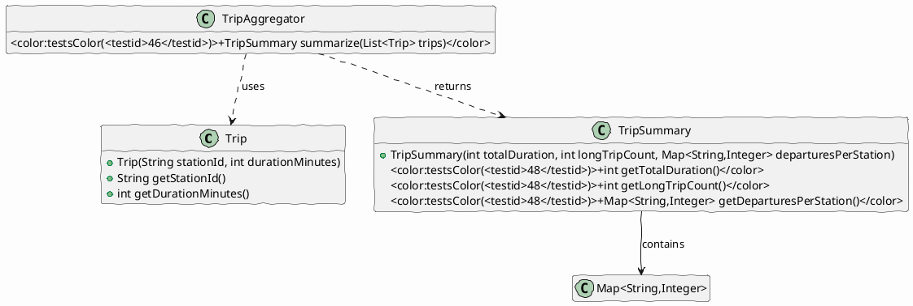

## Bicycle‑Share Trip Summarizer

We work with a list of bike‑share trips. Each trip records the identifier of the departure station and the duration of the ride in minutes.

Your job is to implement the aggregation logic that produces a **summary** containing three statistics:

* the total duration of all *valid* trips,
* the number of *long* trips (duration > 30 min), and
* a map that tells how many valid trips started at each station.

A trip is **valid** only if its duration is **strictly greater than 0**. Trips with a non‑positive duration must be ignored for **all** statistics. The list supplied to the aggregator is never `null` and every `Trip` has a non‑null `stationId`.

### Tasks

[task][Implement aggregation logic](<testid>46</testid>,<testid>45</testid>,<testid>48</testid>,<testid>47</testid>)

*Implement the static method `TripAggregator.summarize(List<Trip>)` so that it returns a `TripSummary` reflecting the rules above.*

### Public API

| Type | Relevant members |
|------|-------------------|
| `Trip` | `Trip(String stationId, int durationMinutes)`<br>`String getStationId()`<br>`int getDurationMinutes()` |
| `TripSummary` | `TripSummary(int totalDuration, int longTripCount, Map<String,Integer> departuresPerStation)`<br>`int getTotalDuration()`<br>`int getLongTripCount()`<br>`Map<String,Integer> getDeparturesPerStation()` |
| `TripAggregator` | `static TripSummary summarize(List<Trip> trips)` |

### Worked examples

```java
// Example 1 – mixed valid and invalid trips
List<Trip> trips = List.of(
    new Trip("A", 10),   // valid, not long
    new Trip("B", 45),   // valid, long
    new Trip("A", -5),   // invalid, ignored
    new Trip("C", 30),   // valid, exactly 30 → not long
    new Trip("B", 31)    // valid, long
);
TripSummary s = TripAggregator.summarize(trips);
// s.getTotalDuration() == 116  (10+45+30+31)
// s.getLongTripCount() == 2   (45 and 31)
// s.getDeparturesPerStation() == Map.of("A",1, "B",2, "C",1)
```

```java
// Example 2 – empty input
TripSummary s = TripAggregator.summarize(Collections.emptyList());
// totalDuration = 0, longTripCount = 0, departuresPerStation = {}
```

### Diagram

