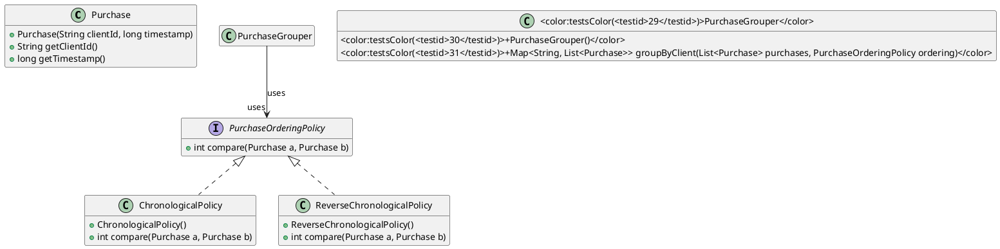

# Grouping Purchases by Client

In this exercise we work with a list of immutable `Purchase` objects. Each purchase belongs to a client (identified by a `String`) and carries a timestamp. Your goal is to implement a **grouper** that creates a map from client identifiers to the purchases made by that client. The list stored for each client must be ordered according to a supplied ordering policy.

## Public API

| Type | Member | Signature |
|------|--------|-----------|
| `Purchase` | Constructor | `public Purchase(String clientId, long timestamp)` |
| `Purchase` | Getter | `public String getClientId()` |
| `Purchase` | Getter | `public long getTimestamp()` |
| `PurchaseOrderingPolicy` | Interface method | `int compare(Purchase a, Purchase b)` |
| `ChronologicalPolicy` | Constructor | `public ChronologicalPolicy()` |
| `ChronologicalPolicy` | Method | `public int compare(Purchase a, Purchase b)` |
| `ReverseChronologicalPolicy` | Constructor | `public ReverseChronologicalPolicy()` |
| `ReverseChronologicalPolicy` | Method | `public int compare(Purchase a, Purchase b)` |
| `PurchaseGrouper` | Constructor | `public PurchaseGrouper()` |
| `PurchaseGrouper` | Core method | `public Map<String, List<Purchase>> groupByClient(List<Purchase> purchases, PurchaseOrderingPolicy ordering)` |

All classes are in the package `de.tum.cit.aet.exgencollectiongroupingandordering`.

## What you have to implement

We provide the immutable `Purchase` class, the `PurchaseOrderingPolicy` interface, and two concrete policies. **Your only task** is to complete the `PurchaseGrouper` class.

### Behavioural requirements

1. **Group by client** – every purchase must appear in the list that belongs to the map entry whose key equals the purchase’s `clientId`.
2. **Order inside each list** – the list for a client must be sorted using the supplied `PurchaseOrderingPolicy`. For any consecutive elements `a` then `b` the comparator must return a value `<= 0`.
3. **Exact key set** – the returned map contains **exactly one entry** for each distinct client identifier that occurs in the input list. No additional keys are allowed.
4. **No loss or duplication** – each purchase from the input appears **once** in the result.
5. **Immutability of inputs** – you must not modify the supplied `List<Purchase>` nor any `Purchase` objects.
6. **Null handling** – if either argument is `null` you must throw a `NullPointerException`.

### Edge cases

* An empty input list yields an empty map.
* If the ordering policy reports equality (`compare` returns `0`) the relative order of those purchases may stay as in the original list (stable ordering).

## Worked example (illustrative only)

```java
List<Purchase> purchases = List.of(
    new Purchase("C1", 5),
    new Purchase("C2", 3),
    new Purchase("C1", 2),
    new Purchase("C2", 8)
);
PurchaseOrderingPolicy policy = new ChronologicalPolicy(); // oldest first

Map<String, List<Purchase>> result = new PurchaseGrouper()
        .groupByClient(purchases, policy);
```

The resulting map is:

```
C1 → [Purchase("C1", 2), Purchase("C1", 5)]
C2 → [Purchase("C2", 3), Purchase("C2", 8)]
```

If we replace the policy with `new ReverseChronologicalPolicy()` the order inside each list is reversed.

## Tasks

[task][Group purchases by client](<testid>35</testid>,<testid>38</testid>,<testid>29</testid>,<testid>30</testid>,<testid>31</testid>)
Implement the `groupByClient` method so that it fulfills requirements R1‑R4 and R6. Ensure the method never mutates the supplied list or the `Purchase` objects.

[task][Order purchases within each client](<testid>36</testid>,<testid>37</testid>)
Make sure the list stored for each client is sorted according to the provided `PurchaseOrderingPolicy`. The ordering must be stable when the comparator returns `0`.

[task][Handle empty input list](<testid>33</testid>)
Return an empty map when the input list contains no purchases.

[task][Stable ordering when timestamps equal](<testid>32</testid>)
When the ordering policy reports equality (`compare` returns `0`) the relative order of those purchases must stay as in the original list (stable sort).
## Diagram

