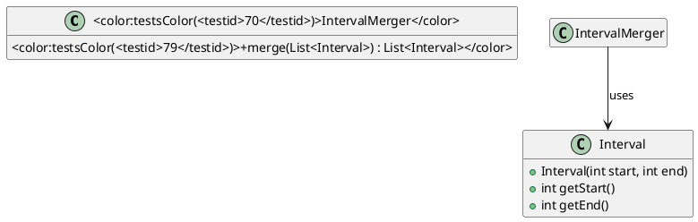

# Merging Overlapping Intervals

We work with **half‑open** integer ranges `[start, end)` – the start value is included, the end value is excluded. An `Interval` object stores such a range and guarantees `start < end`.

Your task is to implement the static method `IntervalMerger.merge`. It receives a `java.util.List<Interval>` that may be empty, may contain `null` entries, and is never `null` (if it is, you must throw an `IllegalArgumentException`). The method must return a new list that:

* contains the same intervals as the input, but merged so that no two intervals overlap or even touch;
* is sorted by the start value in ascending order;
* treats a `null` element as absent – it is ignored;
* treats touching intervals (`a.end == b.start`) as mergeable, i.e. they become a single interval;
* discards intervals that are completely contained in another interval;
* returns an empty list when the input is empty or consists only of `null` elements;
* always produces the same deterministic result for the same admissible input.

The `Interval` class is already provided; you only need to instantiate it. The `merge` method must return a list containing the merged intervals. Modifying the input list is allowed but not required.

## Worked example
```java
List<Interval> in = Arrays.asList(
    new Interval(5, 9),   // [5,9)
    new Interval(1, 4),   // [1,4)
    new Interval(3, 6),   // overlaps with [1,4) and touches [5,9)
    null,                 // ignored
    new Interval(10, 12)  // isolated
);
List<Interval> out = IntervalMerger.merge(in);
// out contains two intervals:
//   [1,9)  (merged from the first three intervals)
//   [10,12)
```

## API
```java
package de.tum.cit.aet.exgenmergeoverlappingintervals;

public class Interval {
    public Interval(int start, int end) { /* throws IllegalArgumentException if start >= end */ }
    public int getStart();
    public int getEnd();
}

public class IntervalMerger {
    public static java.util.List<Interval> merge(java.util.List<Interval> intervals) { /* TODO */ }
}
```

## Diagram


## Tasks

[task][Merge overlapping and touching intervals](<testid>79</testid>,<testid>78</testid>,<testid>72</testid>,<testid>77</testid>,<testid>70</testid>,<testid>71</testid>,<testid>80</testid>)
Implement `IntervalMerger.merge` so that overlapping or touching intervals are combined into a single interval and the resulting list is sorted without any overlaps or touches.

[task][Handle contained intervals and empty input](<testid>76</testid>,<testid>73</testid>)
Make sure intervals that lie completely inside another are removed and that an empty or `null`‑only input yields an empty list.

[task][Null handling and determinism](<testid>74</testid>,<testid>75</testid>)
Throw an `IllegalArgumentException` when the argument list itself is `null`. Treat `null` elements inside the list as absent and guarantee that repeated calls with the same admissible input produce identical results.