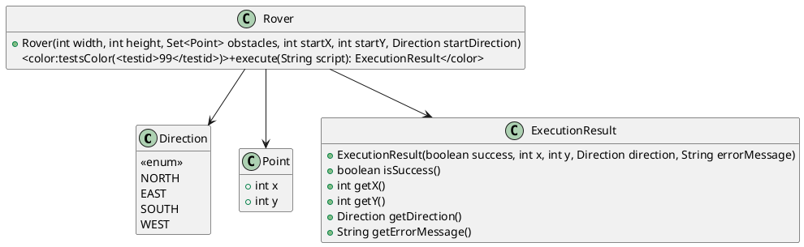

# Bounded Grid Rover

We control a small robot rover that moves on a rectangular grid. The rover can turn left (`L`), turn right (`R`) and move forward one cell (`M`). Your job is to implement the state‑transition logic so that a given command script is executed correctly, respecting the grid limits, a set of obstacles and reporting any error that occurs.

## Public API

| Type | Member | Signature |
|------|--------|-----------|
| `enum Direction` | – | `NORTH, EAST, SOUTH, WEST` |
| `class Point` | fields | `public final int x;` `public final int y;` |
| `class Point` | constructor | `public Point(int x, int y)` |
| `class ExecutionResult` | constructor | `public ExecutionResult(boolean success, int x, int y, Direction direction, String errorMessage)` |
| `class ExecutionResult` | query methods | `boolean isSuccess();` `int getX();` `int getY();` `Direction getDirection();` `String getErrorMessage();` |
| `class Rover` | constructor | `public Rover(int width, int height, java.util.Set<Point> obstacles, int startX, int startY, Direction startDirection)` |
| `class Rover` | core method | `public ExecutionResult execute(String script)` |

The template already contains the enum, the immutable value classes and the `ExecutionResult` holder. You only have to fill in the `Rover` constructor (validation) and the `execute` method.

## Tasks

[task][Process command script correctly](<testid>99</testid>,<testid>96</testid>,<testid>93</testid>,<testid>95</testid>,<testid>97</testid>,<testid>94</testid>,<testid>98</testid>)
Implement the rover so that:
- The constructor validates the grid size, obstacle positions and the start position (must be inside the grid and not an obstacle). Throw `IllegalArgumentException` if a precondition is violated.
- `execute` parses the script character by character. Valid commands are `L`, `R` and `M`. Any other character stops execution and returns a failure result with the message **"Invalid command"**.
- Turning updates the facing direction cyclically (`NORTH → WEST → SOUTH → EAST → NORTH` for a left turn, the reverse for a right turn).
- A move computes the next cell in the current direction. If the cell lies outside the grid, stop and return a failure result with **"Out of bounds"**. If the cell is an obstacle, stop and return a failure result with **"Obstacle encountered"**. In both cases the rover’s position and direction remain as they were before the failing command.
- If the whole script is processed without error, return a success result containing the final position and direction.
- An empty script is valid and yields a successful result with the rover unchanged.
- Passing `null` as the script must throw `IllegalArgumentException`.

## Diagram

