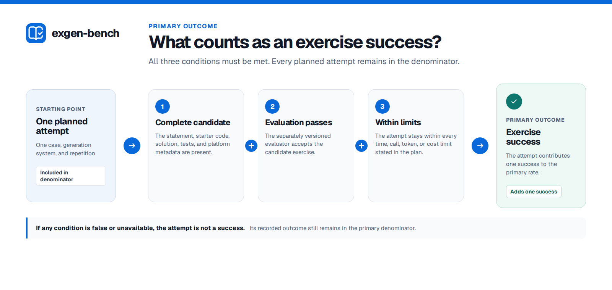

# Methodology

This document defines what a formal exgen-bench study measures and how it handles failures,
repetitions, missing results, and publication. See the [glossary](GLOSSARY.md) for project terms.

## What is measured

The study compares complete generation systems under fixed resource limits, not language models in
isolation. One planned attempt is one observation. Systems are paired on the same case and
repetition. Repetitions belong to a case and system, and uncertainty is calculated by resampling
whole cases. Claims beyond the named cases require a separately justified
[sampling frame](GLOSSARY.md#sampling-frame).

The primary outcome is whether one planned attempt produces a complete exercise, passes the
independent evaluator, and stays within its resource limits. The primary rate is the exercise
success rate:

```text
exercise successes / planned attempts
```

That rate is the primary [estimand](GLOSSARY.md#estimand). A single-arm study estimates the rate
itself; a comparison estimates the difference between two generation systems and must declare the
contrast that names them.



Unstarted attempts, generation failures, abstentions, evaluator infrastructure failures, and
budget violations are not successes. Rates conditional on starting, generation, or an available
quality verdict are reported separately.

Failure attribution is frozen before collection. Failures of the measured system, including its
managed verifier or sandbox, are treatment-attributable operational failures. An uncertain model
call is terminal and is never silently replayed. A host, credential, coordinator, or shared
study-infrastructure outage invalidates and replaces the entire affected randomized block under a
new identity while retaining the original record. Evaluator infrastructure may retry the same
immutable candidate, and never a quality rejection; every evaluation attempt remains in the
append-only journal, which is the record of what was tried and is never rewritten. A confirmatory
release cannot contain an unresolved study or evaluator infrastructure outcome.

This definition follows the emphasis on explicit constructs and deployment context in
[NIST AI 800-3](https://doi.org/10.6028/NIST.AI.800-3) and the workload, repetition, and
reproducibility requirements in the
[ACM SIGSOFT benchmarking standard](https://www2.sigsoft.org/EmpiricalStandards/docs/standards).

## Experimental design

What a comparison additionally requires of the systems themselves is in
[SUT-REQUIREMENTS.md](SUT-REQUIREMENTS.md), which grades those requirements into conformance levels.
A design may not depend on a requirement above the level its systems attain.

- Every compared system receives the same exercise briefs.
- Repetitions are nested within cases; the case is the resampling unit.
- Paired conditions receive the same requested seed, derived from the base seed, the case, and the
  replicate. `seed_status` records what the system reports it did with that seed, and the runner
  rejects a report that contradicts the adapter's declared seed capability. It cannot test whether a
  claimed `honored` seed was really honoured, and no adapter in this repository claims one. Against
  a system that reports `unsupported` — which is what the Artemis adapter reports on every
  attempt — pairing is on the case alone and the seed is a label.
- Case-replicate blocks are deterministically shuffled from the schedule seed, as is system order
  within each block. Order randomization constrains execution order only at concurrency one, and it
  separates two arms only when both can run inside one campaign. When each arm needs its own
  deployment, arm and deployment epoch stay confounded whatever the order
  ([R12, R13](SUT-REQUIREMENTS.md#level-3--comparable)).
- Resource limits and comparison factors are fixed before the run and enter the generation key.
  Each entry of `systems[].factors` declares how it is controlled: `requested` factors are sent to
  the adapter, `observed` factors must be reported back by the system, and `declared` factors are
  labels the harness cannot check. A multi-arm configuration must carry at least one `requested` or
  `observed` factor whose value differs across arms, and an arm whose reported value disagrees with
  its declared one fails the attempt. An adapter declares which factor names it can apply and which
  it can attest, as two separate lists, and preflight refuses a study naming a factor outside them —
  a system may apply a setting it never echoes back, and such a setting cannot ground a contrast.
  Factor names are bare snake_case so that the configuration, the request, the capability and the
  response cannot drift into four spellings. A `declared` factor still describes a configuration
  that some other mechanism must apply
  ([R12, R14](SUT-REQUIREMENTS.md#r12--per-request-configuration-selection)).
- The evaluator and hidden suite are identical across approaches. Hidden requirements, oracles,
  reference solutions, and mutants stay outside every generation system's environment, network, and
  repair loop.
- Generator-side verification is part of the generation system and cannot consume hidden evaluator
  feedback.
- Stateful systems receive fresh logical entities for every attempt
  ([R5](SUT-REQUIREMENTS.md#r5--fresh-state-per-attempt)).

The analysis resamples whole cases: a paired cluster bootstrap for a difference between two systems,
a single-arm cluster bootstrap for one system's rate. The release records the seed, resample count,
confidence level, and predeclared contrast. Protocol version 1 permits one confirmatory contrast; a
larger family needs a registered multiplicity procedure.

## Statistical scale

A comparison declares its smallest meaningful effect in the registration, before collection, along
with the number of cases needed to detect that effect. A design that cannot detect the effect it
cares about is not run: for a difference estimand, planning computes the minimum detectable effect
from the declared power, baseline rate, and correlation assumptions, and refuses the plan when it
exceeds `analysis.design.smallest_meaningful_effect`.

At the scale of the only dataset that exists — 19 cases, one replicate — that requirement bites
hard. With 19 paired cases and a binary outcome, an exact McNemar test cannot reach two-sided
*p* < 0.05 unless at least 6 pairs disagree and every disagreement points the same way: an observed
difference of at least 6/19, or 32 percentage points. Normal-approximation power calculations agree:
the minimum detectable effect at 80% power and a two-sided 5% level is 27 points when two cases in
ten produce different outcomes under the two systems, and 33 points when three in ten do. Detecting
a 10-point difference needs roughly 155 to 233 paired cases across that same discordance range.
Replicates do not lower the floor, because the case is the resampling unit; they estimate
within-case stochasticity.

Single-arm precision is no better. The live Artemis development campaign of 2026-07-31 — 19 cases,
one replicate, described in [ARTEMIS-INTEGRATION.md](ARTEMIS-INTEGRATION.md) — produced 11
successful generations, and a 95% Wilson interval on 11/19 spans 36% to 77%, 41 points wide. That
campaign's evidence is not in this repository, so a reader cannot check the count; the run was also
produced from a dirty working tree, and no gate catches that. The figure describes the generation
outcome, not the [exercise success rate](GLOSSARY.md#exercise-success-rate); no evaluator ran, so
the declared estimand is `null` on every row of that campaign.

The implemented interval is a percentile cluster bootstrap over case-level means
([`analysis/system-bootstrap.ts`](../analysis/system-bootstrap.ts),
[`analysis/paired-bootstrap.ts`](../analysis/paired-bootstrap.ts)). Cameron, Gelbach and Miller show
that cluster-robust and percentile bootstrap procedures over-reject with few clusters — their range
is five to thirty — and recommend a bootstrap-*t* refinement, of which the wild cluster bootstrap is
the standard form. Nineteen clusters sits inside that range, so the implemented interval is
anti-conservative at this scale; a validity-audit simulation of this design put the actual rejection
rate near 7% against a nominal 5%, and that simulation is not checked in. Until a refinement is
implemented, report the interval as descriptive and do not read a nominal 5% test off it.

- A. C. Cameron, J. B. Gelbach and D. L. Miller,
  [Bootstrap-Based Improvements for Inference with Clustered Errors](https://doi.org/10.1162/rest.90.3.414),
  *Review of Economics and Statistics* 90(3), 2008.
- E. Miller,
  [Adding Error Bars to Evals: A Statistical Approach to Language Model Evaluations](https://arxiv.org/abs/2411.00640),
  2024 — evaluation questions as a sample from an unseen super-population, paired analysis to reduce
  variance, and planning an evaluation before running it.

## Not yet enforced

These are design rules the project intends and no checked-in code applies, plus one implemented
behaviour that reads like a control and is not. They are listed separately so that a reader can tell
a control from an intention.

- **Concurrency.** A formal study sets `execution.concurrency: 1` until an interference study rules
  out shared quota, cache, sandbox, provider-queue, and host-resource effects at the intended level.
  The field defaults to 1 and accepts any positive integer; nothing checks the value, and this
  repository's own smoke configurations use 2 and 4 because they drive a mock generator. Enforcing
  the value in code would not settle the question it appears to settle. Serial execution removes
  contention between attempts that overlap; the coupling that threatens independence here is
  temporal. A rolling 24-hour token quota, a cooldown after a provider failure, and a cache or JIT
  state that is cold for the first case and warm for the last all couple attempts that never
  overlap, and a slower campaign makes some of them worse. Independence is a property of the system
  under test, not of the queue depth
  ([R10](SUT-REQUIREMENTS.md#r10--independence-across-attempts-over-time)).
- **Digest pinning and substitution.** The intent is that every component of a compared system —
  image, model serving, evaluator, and toolchain — is pinned by content digest, and that a silent
  substitution invalidates the affected block. Half of that now holds. Detection: the runner digests
  each attempt's reported configuration and fails a later attempt of the same system whose digest
  differs, so a mid-campaign change to anything the system attests is caught rather than silent.
  Pinning: still absent. Nothing resolves or records the digest of the image the engine actually
  ran — a container runtime must only *declare* a reference ending in `@sha256:` and is invoked with
  `--pull never`; an evaluator's `image_digest` is self-declared and unverified; the toolchain is
  pinned by exact version rather than digest; and a `command` runtime — which the Artemis system
  uses — has no digest at all. So a change to a component the system does not report on remains
  invisible. Nothing was digest-pinned in the live campaign.
- **Verified generator-visible fixture.** The intent is that paired attempts start from a fixture
  proven identical. No code digests a generator-visible fixture or compares one across attempts.
- **Missing quality verdicts in a difference.** An attempt with no evaluation contributes `null` at
  the row level and is then counted as a non-success in both estimands, which is correct for a rate
  whose denominator is planned attempts. In the paired table the `pair_complete` flag is currently
  constant, so the filter that reads it excludes nothing; `quality_outcome_available_a` and
  `quality_outcome_available_b` are recorded and are the fields to check before reading a
  difference.

The repository refuses to create a `submitted` release, so none of these gaps can reach a
confirmatory claim; they can and do reach an exploratory one.

## Outcomes

Generation and evaluation have separate outcome spaces.

Generation records:

- planned, running, completed, failed, cancelled, and interrupted lifecycle states;
- succeeded, failed, abstained, or infrastructure-failed generator outcomes;
- artifact and evidence digests;
- wall time, model/tool calls, tokens, and cost when available; and
- budget compliance and missing usage fields.

Evaluation records:

- strict success or quality failure;
- infrastructure failure without a quality verdict;
- versioned metric values and denominators; and
- evaluator, suite, configuration, and evidence identities.

Secondary measures may include buildability, test execution, solution/starter behavior, task
binding, coverage, and rejection of specification-derived semantic mutants. These describe
specific properties and are not combined into a single score. Stronger tests can materially change
measured functional correctness, as demonstrated by
[EvalPlus](https://proceedings.neurips.cc/paper_files/paper/2023/hash/43e9d647ccd3e4b7b5baab53f0368686-Abstract-Conference.html).

Human-rated properties such as clarity, difficulty, and learning-objective alignment require a
blinded rubric, independent ratings, a reliability subset, and reported agreement. An LLM judge is
treated as another instrument and must be validated against expert ratings.

## Dataset

The public dataset contract records:

- a stable dataset version and case ID;
- the exercise brief visible to generators;
- tags; and
- origin, authorship, license, publication history, and known exposure.

Objectives, hidden tests, vetted reference artifacts, semantic mutants, exclusions, and limitations
belong to the independently versioned evaluator suite or restricted study materials, not the public
dataset file. The generation request is built only from the public case fields. Evaluator assets and
feedback must not enter a generator's repair loop.

Cases live in three separately versioned pools:

| Pool | Purpose | Exposure rule |
| --- | --- | --- |
| Development | Fast regression and root-cause iteration | Public; any inspected result stays here permanently |
| Restricted validation | Controlled instrument and approach tuning | Query-limited; moves to development once its feedback has been used |
| Sealed confirmation | Frozen claims | One-shot or tightly governed; never used for repair |

The [Hyperion development pack](../datasets/hyperion-development-v1/README.md) is the only pool that
exists today. The other two do not, so no exgen study can currently make a confirmatory claim.

Existing public exercises may have appeared in model training data, so releases document known
exposure without claiming that contamination is absent.

Paraphrases of one brief share a case family and must not be counted as independent sampling units;
resample families rather than variants. Version 1 of the development pack has no families, so this
rule has nothing to constrain there yet.

Dataset documentation follows
[Datasheets for Datasets](https://doi.org/10.1145/3458723) and
[Data Cards](https://research.google/pubs/data-cards-purposeful-and-transparent-dataset-documentation-for-responsible-ai/).

## Reproducibility

A run records the resolved dataset, systems, target, configuration, source and lockfile hashes,
declared container images, generator descriptions, Bun version, operating system, and architecture.
During execution, attempt directories capture requests, logs, and any responses, files, or events
produced. Finished attempts also retain a validated observation and evidence manifest. The current
manifest does not verify the runner binary, container-engine settings, host resources, or actual
network and sandbox controls. A formal study therefore needs a separate record of its execution
environment before data collection.

SQLite coordinates execution but is not a publication format. A release contains normalized JSONL
and CSV, analysis summaries, metric cards, checksums,
[Croissant 1.1](https://docs.mlcommons.org/croissant/docs/croissant-spec-1.1.html) metadata, and an
[RO-Crate 1.2](https://www.researchobject.org/ro-crate/specification/1.2/).

Public releases omit raw evaluator messages, evidence locations, local paths, runtime commands, and
arbitrary adapter parameters. Hashes can link public records to a separately retained private
archive: a BagIt 1.0 bag carrying both SHA-256 and SHA-512 manifests as RFC 8493 section 2.4
requires, described in [RESTRICTED-ARCHIVES.md](RESTRICTED-ARCHIVES.md). Text-valued public metrics
require a fixed list of allowed values in their metric description.

The repository currently refuses to create a `submitted` release. Enabling that designation
requires enforceable gates for:

1. a timestamped, frozen registration snapshot that predates collection and matches the plan;
2. terminal coverage of every planned attempt;
3. independent evaluation of every generated candidate;
4. a validated evaluator-suite manifest, including hidden-asset and toolchain digests;
5. a private raw-data archive with recorded file hashes;
6. complete dataset provenance and licensing;
7. resolved generation-system and model attestations;
8. effective seed, parameter, and provider-request provenance; and
9. effective runtime and environment attestation.

Before data collection, the study must freeze its cases, hypotheses, outcomes, exclusions, retry
rules, contrasts, and sample size. Registration can use
[OSF Registrations](https://help.osf.io/article/330-welcome-to-registrations). The final artifact
should support the ACM
[artifact review and badging](https://www.acm.org/publications/policies/artifact-review-and-badging-current)
criteria.

## Reporting

Each aggregate reports its numerator, denominator, interval method, missingness, exclusions,
retries, and versioned provenance. Public views distinguish illustrative examples from exploratory
releases. Downloadable release data remains the source of record.

Process telemetry follows the claim-specific authority and cross-system OpenTelemetry profile in
[TELEMETRY.md](TELEMETRY.md). It supports accounting, diagnostics, and treatment-fidelity analysis;
it never substitutes for independent candidate-quality evaluation.
